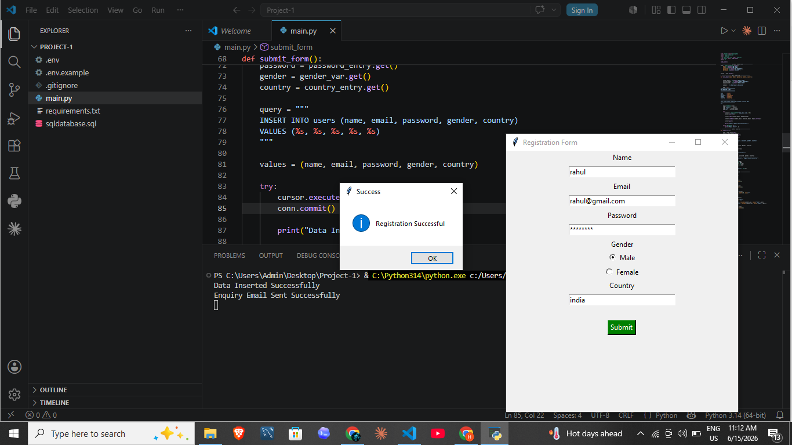

# Tkinter Registration Form with MySQL & Email Notifications

A simple Python desktop application built using Tkinter with MySQL database integration and Gmail email notifications.

---

## 🚀 Features

- User Registration Form
- MySQL Database Integration
- Gmail Email Notification
- Secure Environment Variables (.env)
- Simple Tkinter GUI Interface

---

## 🛠️ Technologies Used

- Python
- Tkinter
- MySQL
- SMTP (Gmail)
- python-dotenv

---

## 📸 Screenshots

### 🏠 Registration Form



### ✅ Success Message


---

## 📥 Installation

### 1. Clone the repository
```bash
git clone <your-repo-url>